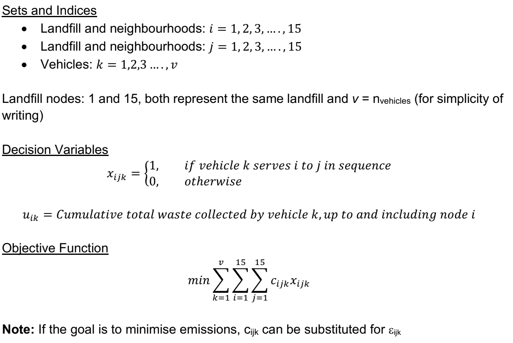
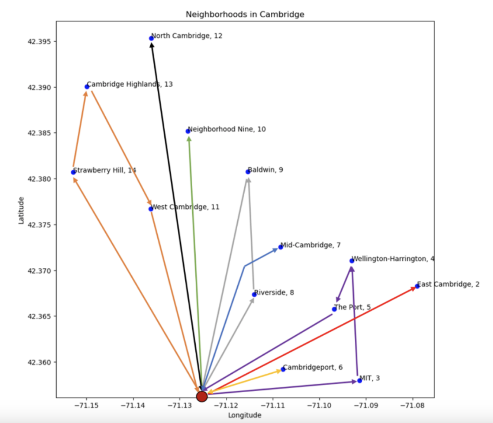

# Optimisation Project: Refuse Vehicle Routing for Cambridge, MA
MIT 15.093 Optimization Methods

## Problem Statement
In the city of Cambridge, the transportation of municipal solid waste (MSW) from households to waste treatment facilities is typically handled by a fleet of garbage vehicles. These treatment facilities primarily include landfills, incinerators, and transfer stations. However, the current routing of these vehicles lacks optimization, resulting in various drawbacks such as increased costs for waste management businesses and higher emissions. This project aimed to address the "vehicle routing problem" (VRP) specifically for optimising the routing of refuse vehicles from residential areas in Cambridge to landfills.

## Methodology and Approach
First, data was gathered on the following:

- **Housing Neighbourhoods**: different neighbourhood names, centroids of the different neighbourhoods, number of homes per neighbourhood, locations, etc.
- **Waste Treatment Facilities**: capacity of each facility, distances relative to Cambridge, status - active or inactive, etc.
- **Operating Costs**: costs of operating a refuse vehicle, which is scaled in proportion to distance between neighbourhoods (i.e., a cost matrix between each possible neighbourhood pair in Cambridge). Expressed in units of [$/km].
- **Emissions**: like operating costs, this was also scaled in proportion to distance between neighbourhoods. Expressed in units of [kg-eCO2/km].
- **Waste Production**: how much waste each household produces, which was then scaled up to the neighbourhood level based on how many households there were per neighbourhood.

Second, the following assumptions were made to simplify the problem:

- Each neighbourhood can be represented by a single node located at the neighbourhood centroid.
- We only consider one active landfill to serve all 14 neighbourhoods in Cambridge, as the landfill's capacity was sufficient.
- An aggregated representation of a garbage vehicle is used to mirror the clustering of households in a neighborhood into a single node. If neighborhood X needs seven vehicles, we assign an aggregated garbage vehicle a capacity equivalent to seven individual vehicles. Correspondingly, we scale up emissions and costs, making an aggregated vehicle seven times costlier than an individual one to maintain parity.

Third, the data and assumptions were integrated into the optimisation framework as outlined in the figure below. For the full formulation, see section 8.0, Appendix A of the report.

## Optimisation Model Constraints
1. No travel from a node to itself
2. No direct travel between landfill nodes (nodes 1 and 15)
3. No outflow travel from landfill (node 15); all routes terminate at landfill node 15
4. No inflow travel into node 1; all routes begin and depart from landfill node 1
5. Each vehicle departing from landfill node 1 goes to exactly 1 neighborhood
6. Each neighborhood j is visited exactly once (node 15 can be visited > 1 time)
7. Each vehicle must return to landfill node 15
8. Vehicle capacity cannot be exceeded
9. Miller-Tucker-Zemlin (MTZ) subtour elimination
10. Each vehicle departs from the same node in which it entered
11. Binary decision variable, x

## Results and Discussion
The results of the optimised model were compared against a baseline. This baseline was a greedy search such that at each neighbourhood node, we are looking for the cheapest unvisited neighbourhood node to visit next until we either violate the vehicular capacity constraint or have served all neighbourhoods. We found a savings of ~0.85% relative to the baseline for both costs and emissions. The vehicle routes are shown in the figure below, with each colour representing a separate refuse vehicle.

| Minimisation Objective: Cost | Baseline Model | Optimised Model |
|-----------------------|----------------|-----------------|
| Total Operating Cost  | $4084.57       | $4049.52        |
| Total Savings         |                | $35.05 (0.85%)  |

| Minimisation Objective: Emissions | Baseline Model | Optimised Model |
|----------------------------|----------------|-----------------|
| Total Emissions [kg-eCO2]  | 8157.24        | 8099.04         |
| Total Reduction [kg-eCO2]  |                | 58.20 (0.85%)   |

Of note, the overall routes are identical for both minimising costs and emissions, suggesting that minimising one will minimise the other too. The reason for this is due to how the data was set up such that the emissions and cost matrices were set up in a similar fashion: scaled up by two constants, as outlined in section 2.0. Thus, the costs and emissions are proportional. As one increases so too does the other and minimising one, will also minimise the other (i.e., no obvious trade-off relationship). Hence, the routes chosen would be the same when minimising both emissions and costs. Improvements have been suggested in section 6.0 of the report.

## Report
[15.093 Final Report](./opti-report.pdf)

## Poster
[15.093 Poster](./opti-poster.pptx)

## Notebooks
- *01-data_preprocessing.ipynb*: Data preprocessing notebook, ran in Python
- *02-cvrp-model.ipynb*: Full formulated capacitated Vehicle Routing Problem (CVRP) model, ran in Julia
